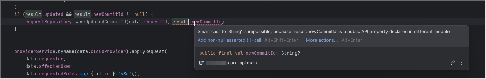

# Kotlin programming language

[Tiobe](https://www.tiobe.com/tiobe-index/kotlin/)

---

# Kotlin features in a nutshell

* Less code -> less bugs
* Null Safety
* Fully interoperable with Java
* Functional programming friendly
* Smart compiler

---

# Functional style

* Immutability (variables and data structures)
* Lambdas
* Higher order functions
* Expressions
* [Scope functions](https://kotlinlang.org/docs/scope-functions.html#function-selection)

---

# Smart compiler example

---

# Data Classes

https://stackoverflow.com/a/66807237

---

# Bigger Feature Overview

https://www.slideshare.net/YeldosTanikin/kotlin-249465209?from_search=1#6

even more:

https://www.slideshare.net/slideshow/introduction-to-kotlin-180510850/180510850

---

# More Code

---

# Try it

* It may look unfamiliar or hard to read at first
* Probably less so if you had exposure to Typescript, Swift, Rust, ...
* Find something to try it - even just your tests
* 2 Months until AOC ;)

---

# Word of advice

* Give non-null values a chance
* Give immutability a chance
* As always: use a formatter (like ktfmt)
* Even "Java-Style" + nonNull + immutable is already a big win

---

# Word of caution

* When starting to use it, don't go overboard with language features
* Find a common style
* Great power, great responsibility. You know the drill

